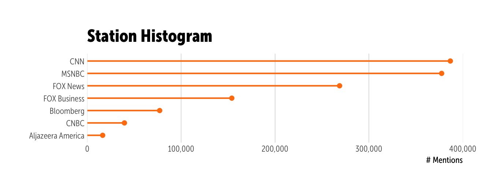
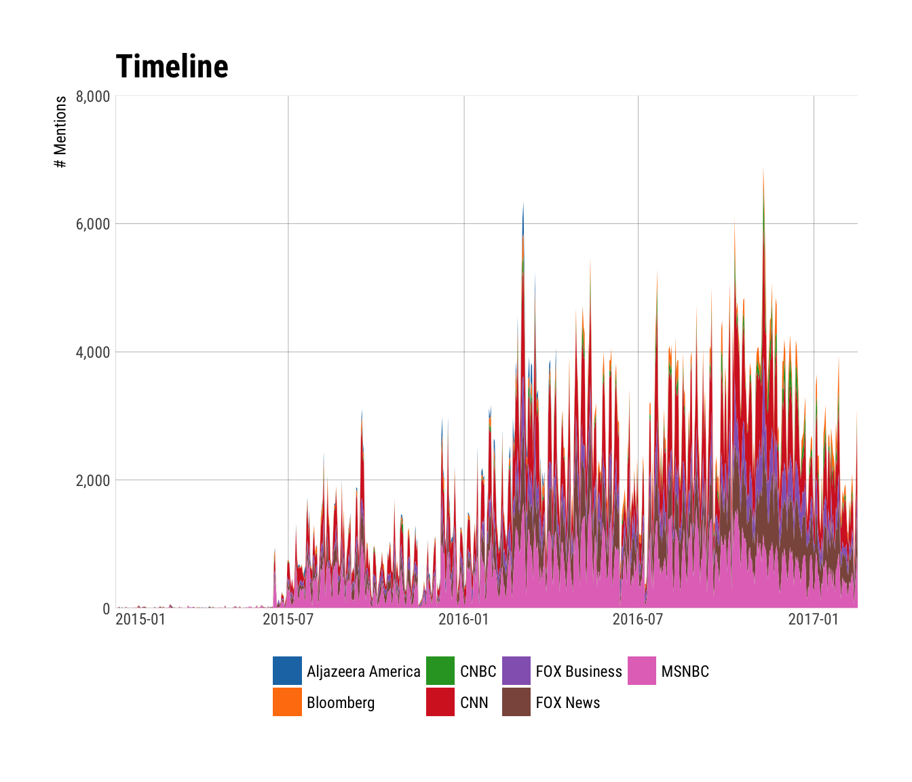

`newsflash` : Tools to Work with the Internet Archive and GDELT Television Explorer

Ref: <http://television.gdeltproject.org/cgi-bin/iatv_ftxtsearch/iatv_ftxtsearch>

> *"In collaboration with the Internet Archive's Television News Archive, GDELT's Television Explorer allows you to keyword search the closed captioning streams of the Archive's 6 years of American television news and explore macro-level trends in how America's television news is shaping the conversation around key societal issues. Unlike the Archive's primary Television News interface, which returns results at the level of an hour or half-hour "show," the interface here reaches inside of those six years of programming and breaks the more than one million shows into individual sentences and counts how many of those sentences contain your keyword of interest. Instead of reporting that CNN had 24 hour-long shows yesterday that mentioned Donald Trump, the interface here will count how many sentences uttered on CNN yesterday mentioned his name - a vastly more accurate metric for assessing media attention."*

An advantage of using this over the interactive selector & downloader is that you get tidy tibbles with this package, ready to use in R.

The following functions are implemented:

-   `query_tv`: Issue a query to the TV Explorer
-   `top_text`: Helper function to extract the text snippets from the top matches as a tidytext-compatible tibble or plain character vector
-   `list_networks`: Helper function to identify station/network keyword and corpus date range for said market
-   `print.newsflash`: Helper print method for a nicer default text summary

### Installation

``` r
devtools::install_github("hrbrmstr/newsflash")
```

``` r
options(width=120)
```

### Usage

``` r
library(newsflash)
library(tidyverse)
library(ggalt) # github version
library(hrbrmisc)

# current verison
packageVersion("newsflash")
```

    ## [1] '0.3.0'

See what networks & associated corpus date ranges are available:

``` r
list_networks(widget=FALSE)
```

    ## # A tibble: 53 × 3
    ##                       keyword                             network                          date_range
    ##                         <chr>                               <chr>                               <chr>
    ## 1                    NATIONAL               All National Networks (See individual networks for dates)
    ## 2                     ALJAZAM                   Aljazeera America             (8/20/2013 - 4/13/2016)
    ## 3                   BLOOMBERG                           Bloomberg             (12/5/2013 - 1/25/2017)
    ## 4                        CNBC                                CNBC              (7/2/2009 - 1/25/2017)
    ## 5                         CNN                                 CNN              (7/2/2009 - 1/25/2017)
    ## 6                         FBC                        FOX Business             (8/20/2012 - 1/25/2017)
    ## 7                    FOXNEWSW                            FOX News             (7/16/2011 - 1/25/2017)
    ## 8                       MSNBC                               MSNBC              (7/2/2009 - 1/25/2017)
    ## 9               INTERNATIONAL          All International Networks (See individual networks for dates)
    ## 10                 BBCNEWSSEG                            BBC News              (1/1/2017 - 1/26/2017)
    ## 11                  AFFNETALL              All Affiliate Networks (See individual networks for dates)
    ## 12                 AFFNET_ABC              ABC Affiliate Stations              (7/2/2009 - 1/26/2017)
    ## 13                 AFFNET_CBS              CBS Affiliate Stations              (7/2/2009 - 1/26/2017)
    ## 14                 AFFNET_FOX              FOX Affiliate Stations              (7/3/2009 - 1/26/2017)
    ## 15                AFFNET_MYTV             MYTV Affiliate Stations            (12/11/2015 - 12/2/2016)
    ## 16                 AFFNET_NBC              NBC Affiliate Stations              (7/2/2009 - 1/26/2017)
    ## 17                 AFFNET_PBS              PBS Affiliate Stations             (7/14/2010 - 1/26/2017)
    ## 18                 AFFMARKALL               All Affiliate Markets (See individual networks for dates)
    ## 19           AFFMARKET_Boston           Boston Affiliate Stations             (9/30/2015 - 12/2/2016)
    ## 20     AFFMARKET_Cedar Rapids     Cedar Rapids Affiliate Stations            (10/19/2015 - 12/2/2016)
    ## 21        AFFMARKET_Charlotte        Charlotte Affiliate Stations              (2/9/2016 - 3/23/2016)
    ## 22       AFFMARKET_Cincinnati       Cincinnati Affiliate Stations              (1/6/2016 - 3/23/2016)
    ## 23        AFFMARKET_Cleveland        Cleveland Affiliate Stations              (1/6/2016 - 12/2/2016)
    ## 24 AFFMARKET_Colorado Springs Colorado Springs Affiliate Stations              (1/19/2016 - 3/9/2016)
    ## 25         AFFMARKET_Columbia         Columbia Affiliate Stations             (12/28/2015 - 3/2/2016)
    ## 26  AFFMARKET_Dakota Dunes SD  Dakota Dunes SD Affiliate Stations             (10/13/2015 - 3/2/2016)
    ## 27    AFFMARKET_Daytona Beach    Daytona Beach Affiliate Stations              (1/6/2016 - 3/23/2016)
    ## 28           AFFMARKET_Denver           Denver Affiliate Stations              (1/1/2016 - 12/2/2016)
    ## 29       AFFMARKET_Des Moines       Des Moines Affiliate Stations             (10/14/2015 - 3/2/2016)
    ## 30           AFFMARKET_Durham           Durham Affiliate Stations             (1/13/2016 - 3/23/2016)
    ## 31        AFFMARKET_Goldsboro        Goldsboro Affiliate Stations             (1/13/2016 - 12/2/2016)
    ## 32       AFFMARKET_Greenville       Greenville Affiliate Stations             (12/28/2015 - 3/2/2016)
    ## 33          AFFMARKET_Hampton          Hampton Affiliate Stations               (1/6/2016 - 3/9/2016)
    ## 34        AFFMARKET_Las Vegas        Las Vegas Affiliate Stations            (12/11/2015 - 12/2/2016)
    ## 35        AFFMARKET_Lynchburg        Lynchburg Affiliate Stations              (1/26/2016 - 3/1/2016)
    ## 36            AFFMARKET_Miami            Miami Affiliate Stations              (1/6/2016 - 3/23/2016)
    ## 37       AFFMARKET_Newport KY       Newport KY Affiliate Stations              (1/6/2016 - 3/23/2016)
    ## 38          AFFMARKET_Norfolk          Norfolk Affiliate Stations               (1/6/2016 - 3/9/2016)
    ## 39          AFFMARKET_Orlando          Orlando Affiliate Stations              (1/6/2016 - 3/23/2016)
    ## 40     AFFMARKET_Philadelphia     Philadelphia Affiliate Stations              (6/6/2014 - 1/26/2017)
    ## 41       AFFMARKET_Portsmouth       Portsmouth Affiliate Stations               (1/6/2016 - 3/9/2016)
    ## 42           AFFMARKET_Pueblo           Pueblo Affiliate Stations              (1/19/2016 - 3/9/2016)
    ## 43          AFFMARKET_Raleigh          Raleigh Affiliate Stations             (1/13/2016 - 12/2/2016)
    ## 44             AFFMARKET_Reno             Reno Affiliate Stations               (1/1/2016 - 3/2/2016)
    ## 45          AFFMARKET_Roanoke          Roanoke Affiliate Stations              (1/26/2016 - 3/1/2016)
    ## 46    AFFMARKET_San Francisco    San Francisco Affiliate Stations             (7/14/2010 - 1/26/2017)
    ## 47   AFFMARKET_Shaker Heights   Shaker Heights Affiliate Stations              (1/6/2016 - 12/2/2016)
    ## 48       AFFMARKET_Sioux City       Sioux City Affiliate Stations             (10/13/2015 - 3/2/2016)
    ## 49   AFFMARKET_St. Petersburg   St. Petersburg Affiliate Stations              (1/6/2016 - 12/2/2016)
    ## 50            AFFMARKET_Tampa            Tampa Affiliate Stations              (1/6/2016 - 12/2/2016)
    ## 51   AFFMARKET_Virginia Beach   Virginia Beach Affiliate Stations               (1/7/2016 - 3/8/2016)
    ## 52    AFFMARKET_Washington DC    Washington DC Affiliate Stations              (7/2/2009 - 1/26/2017)
    ## 53         AFFMARKET_Waterloo         Waterloo Affiliate Stations            (10/19/2015 - 12/2/2016)

Basic search:

``` r
query_tv("clinton", "email", "AFFMARKALL", as.Date("2016-01-01"), as.Date("2016-11-15"))
```

    ## Query:
    ##    Primary keyword: clinton 
    ##   Context keywords: email 
    ##           Stations: AFFMARKALL 
    ##         Start date: 2016-01-01 
    ##           End date: 2016-11-15 
    ## 
    ## 25,920 timeline results from 81 stations:
    ## 
    ##   +--+--------------------+-----------------*--+--------------------+---------------------+----+
    ## 6 +                                         *                                                  +
    ##   |              *                  *       *                  *                           *   |
    ## 4 +   * *        *         *        *       *                  **                          *   +
    ##   |   * *        *         *        *       *  *         *     ** *                    *   *   |
    ## 2 +   ***        *   *  * **      * *       * ***        *     ** ***   *  *           **  *   +
    ##   |   *** **  ** *   **** **      ****  *   ****** *     ***** ** ***   ** ***  **   **** **   |
    ## 0 +--+******-******************-******************-*******************-******************-**---+
    ##      0                   20                   40                   60                    80     
    ## Legend: 
    ## 1=ABC - Boston (WCVB), 2=ABC - Boston (WMUR), 3=ABC - Cedar Rapids (KCRG), 4=ABC - Charlotte (WS
    ## OC), 5=ABC - Cincinnati (WCPO), 6=ABC - Cleveland (WEWS), 7=ABC - Colorado Springs (KRDO), 8=ABC
    ##  - Columbia (WOLO), 9=ABC - Denver (KMGH), 10=ABC - Hampton (WVEC), 11=ABC - Las Vegas (KTNV), 1
    ## 2=ABC - Lynchburg (WSET), 13=ABC - Miami (WPLG), 14=ABC - Orlando (WFTV), 15=ABC - Philadelphia 
    ## (WPVI), 16=ABC - Reno (KOLO), 17=ABC - Sioux City (KCAU), 18=ABC - Tampa (WFTS), 19=ABC - Washin
    ## gton DC (WJLA), 20=CBS - Boston (WBZ), 21=CBS - Cedar Rapids (KGAN), 22=CBS - Charlotte (WBTV), 
    ## 23=CBS - Cincinnati (WKRC), 24=CBS - Colorado Springs (KKTV), 25=CBS - Columbia (WLTX), 26=CBS -
    ##  Dakota Dunes SD (KMEG), 27=CBS - Denver (KCNC), 28=CBS - Des Moines (KCCI), 29=CBS - Las Vegas 
    ## (KLAS), 30=CBS - Miami (WFOR), 31=CBS - Norfolk (WTKR), 32=CBS - Orlando (WKMG), 33=CBS - Philad
    ## elphia (KYW), 34=CBS - Raleigh (WRAL), 35=CBS - Reno (KTVN), 36=CBS - Roanoke (WDBJ), 37=CBS - S
    ## an Francisco (KPIX), 38=CBS - Shaker Heights (WOIO), 39=CBS - St. Petersburg (WTSP), 40=CBS - Wa
    ## shington DC (WUSA), 41=FOX - Boston (WFXT), 42=FOX - Cedar Rapids (KFXA), 43=FOX - Cleveland (WJ
    ## W), 44=FOX - Columbia (WACH), 45=FOX - Dakota Dunes SD (KPTH), 46=FOX - Denver (KDVR), 47=FOX - 
    ## Des Moines (KDSM), 48=FOX - Greenville (WHNS), 49=FOX - Las Vegas (KVVU), 50=FOX - Newport KY (W
    ## XIX), 51=FOX - Orlando (WOFL), 52=FOX - Philadelphia (WTXF), 53=FOX - Raleigh (WRAZ), 54=FOX - R
    ## oanoke (WFXR), 55=FOX - San Francisco (KTVU), 56=FOX - Tampa (WTVT), 57=FOX - Virginia Beach (WV
    ## BT), 58=FOX - Washington DC (WTTG), 59=MYTV - Las Vegas (KSNV), 60=NBC - Boston (WHDH), 61=NBC -
    ##  Charlotte (WCNC), 62=NBC - Cincinnati (WLWT), 63=NBC - Cleveland (WKYC), 64=NBC - Columbia (WIS
    ## ), 65=NBC - Daytona Beach (WESH), 66=NBC - Denver (KUSA), 67=NBC - Des Moines (WHO), 68=NBC - Go
    ## ldsboro (WNCN), 69=NBC - Greenville (WYFF), 70=NBC - Miami (WTVJ), 71=NBC - Philadelphia (WCAU),
    ##  72=NBC - Portsmouth (WAVY), 73=NBC - Pueblo (KOAA), 74=NBC - Reno (KRNV), 75=NBC - Roanoke (WSL
    ## S), 76=NBC - San Francisco (KNTV), 77=NBC - Sioux City (KTIV), 78=NBC - Tampa (WFLA), 79=NBC - W
    ## ashington DC (WRC), 80=NBC - Waterloo (KWWL), 81=PBS - San Francisco (KQED)
    ## 
    ## 1,000 top query matches from the following shows:
    ## 
    ## Source: local data frame [322 x 3]
    ## Groups: station [61]
    ## 
    ##                       station                            show     n
    ##                         <chr>                           <chr> <int>
    ## 1  PBS - San Francisco (KQED)                    PBS NewsHour    49
    ## 2         ABC - Boston (WCVB)          Newscenter 5 Eyeopener    39
    ## 3  CBS - San Francisco (KPIX)              KPIX 5 News at 5PM    23
    ## 4          FOX - Tampa (WTVT)         Good Day Tampa Bay  9AM    18
    ## 5  CBS - San Francisco (KPIX)            KPIX 5 News at 600PM    16
    ## 6          CBS - Boston (WBZ)                WBZ This Morning    14
    ## 7  CBS - San Francisco (KPIX)                     KPIX 5 News    13
    ## 8   FOX - Cedar Rapids (KFXA)                Fox 28 News at 9    12
    ## 9          NBC - Tampa (WFLA)           News Ch8 Today at 6AM    12
    ## 10 PBS - San Francisco (KQED) Washington Week With Gwen Ifill    12
    ## # ... with 312 more rows

The closed-caption text snippets are returned for the "top matches" (usually max 1,000 for a broad enough search) and you can extract them from the object directly with `x$top_matches$snippet` or use `top_text(x)`:

``` r
top_text(query_tv("cheese", filter_network="AFFNETALL"))
```

    ## # A tibble: 40,649 × 4
    ##                   station                         show  show_date      word
    ##                     <chr>                        <chr>     <dttm>     <chr>
    ## 1  NBC - Goldsboro (WNCN) North Carolina News at 530AM 2016-11-25 telephone
    ## 2  NBC - Goldsboro (WNCN) North Carolina News at 530AM 2016-11-25     rings
    ## 3  NBC - Goldsboro (WNCN) North Carolina News at 530AM 2016-11-25       o.k
    ## 4  NBC - Goldsboro (WNCN) North Carolina News at 530AM 2016-11-25       say
    ## 5  NBC - Goldsboro (WNCN) North Carolina News at 530AM 2016-11-25    cheese
    ## 6  NBC - Goldsboro (WNCN) North Carolina News at 530AM 2016-11-25    cheese
    ## 7  NBC - Goldsboro (WNCN) North Carolina News at 530AM 2016-11-25    cheese
    ## 8  NBC - Goldsboro (WNCN) North Carolina News at 500AM 2016-11-25       hmm
    ## 9  NBC - Goldsboro (WNCN) North Carolina News at 500AM 2016-11-25    really
    ## 10 NBC - Goldsboro (WNCN) North Carolina News at 500AM 2016-11-25      what
    ## # ... with 40,639 more rows

``` r
head(top_text(query_tv("cheese", filter_network="AFFNETALL"), tidy=FALSE))
```

    ## [1] " [telephone rings] o.k., say 'cheese.' cheese! cheese!"                                                                                                                                                        
    ## [2] "hmm. really? what do you kids talk about for that long? nothing. stuff. [telephone rings] o.k., say 'cheese.' cheese! cheese!"                                                                                 
    ## [3] "why do you keep coming out here? because we're dummies. we're dummies. we're too loyal. cheese burger, cheese burger, cheese burger."                                                                          
    ## [4] "it's not helping. i'm reading massive synaptic failure. that doesn't make anansense. this is the last one. say, 'cheesese.' cheese. cheese."                                                                   
    ## [5] "brains! brains! sorry, guys, i get a little weird, but i found something to solve that, a cheese ball recipe, a brain cheese ball recipe. >> brains? not bread? nope. cheese brain. it's a cheese ball recipe."
    ## [6] "i will tell you, giada, i stole hoda's top after i ate mine of yours. because hoda can't eat cheese. >> this thing is amazing. that's delicious. brussels sprouts are good. it's like cheese and cheese."

You can, of course, do other things with the various bits of data returned:

``` r
orange <- query_tv("trump")
```

``` r
arrange(orange$station_histogram, value) %>% 
  mutate(station=factor(station, levels=station)) %>% 
  ggplot(aes(value, station)) +
  geom_lollipop(horizontal=TRUE, size=0.75,
                color=ggthemes::tableau_color_pal()(10)[2]) +
  scale_x_continuous(expand=c(0,0), label=scales::comma, limits=c(0,100000)) +
  labs(y=NULL, x="# Mentions",
       title="Station Histogram") +
  theme_hrbrmstr_msc(grid="X")
```



``` r
ggplot(orange$timeline, aes(date_start, value)) +
  geom_area(aes(group=station, fill=station), position="stack") +
  scale_x_datetime(name=NULL, expand=c(0,0)) +
  scale_y_continuous(name="# Mentions", label=scales::comma, limits=c(0, 8000), expand=c(0,0)) +
  ggthemes::scale_fill_tableau(name=NULL) +
  labs(title="Timeline") +
  theme_hrbrmstr_msc(grid="XY") +
  theme(legend.position="bottom") +
  theme(axis.text.x=element_text(hjust=c(0, 0.5, 0.5, 0.5, 0.5, 0.5)))
```



The following is dynamically generated from the query results. View the R Markdown to see the code.

#### FOX Business / Countdown to the Closing Bell With Liz Claman

<https://archive.org/details/FBC_20161025_190000_Countdown_to_the_Closing_Bell_With_Liz_Claman#start/3280/end/3315>

<!--html_preserve-->
<!--/html_preserve-->

> "\[cheering\] boy, this is a big crowd by the way. \[cheering\] a lot of people. this is a lot of people. 🍊. 🍊, 🍊, 🍊, 🍊."

### Test Results

``` r
library(newsflash)
library(testthat)

date()
```

    ## [1] "Fri Jan 27 19:02:24 2017"

``` r
test_dir("tests/")
```

    ## testthat results ========================================================================================================
    ## OK: 0 SKIPPED: 0 FAILED: 0
    ## 
    ## DONE ===================================================================================================================
