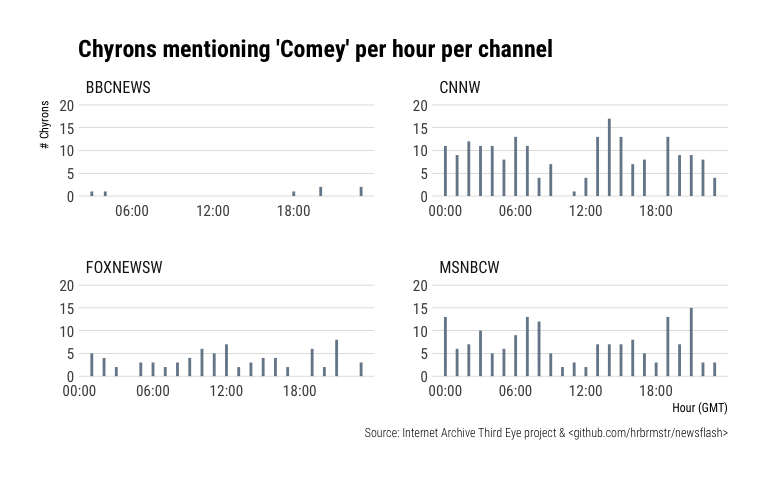
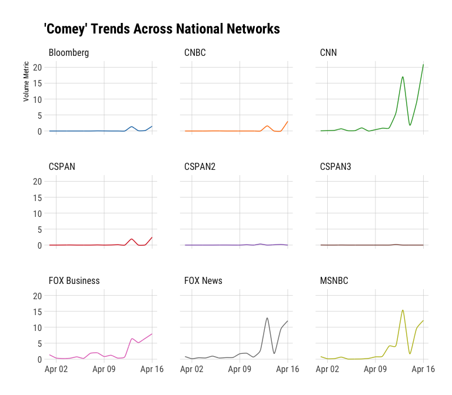
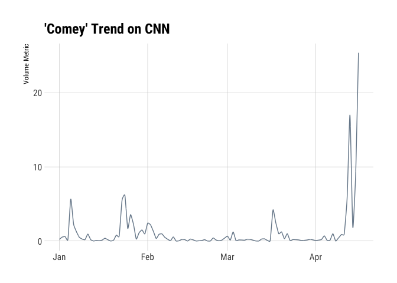
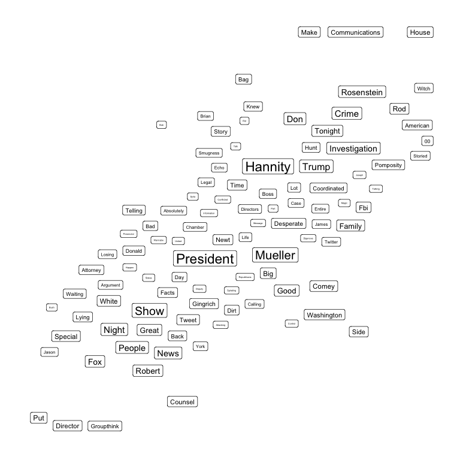

\*\*\* BREAKING CHANGES \*\*\*

# newsflash

Tools to Work with the Internet Archive and GDELT Television
    Explorer

## Description

Ref:

  - <http://television.gdeltproject.org/cgi-bin/iatv_ftxtsearch/iatv_ftxtsearch>
  - <https://archive.org/details/third-eye>

TV Explorer: 

>_“In collaboration with the Internet Archive’s
Television News Archive, GDELT’s Television Explorer allows you to
keyword search the closed captioning streams of the Archive’s 6 years of
American television news and explore macro-level trends in how America’s
television news is shaping the conversation around key societal issues.
Unlike the Archive’s primary Television News interface, which returns
results at the level of an hour or half-hour”show," the interface here
reaches inside of those six years of programming and breaks the more
than one million shows into individual sentences and counts how many of
those sentences contain your keyword of interest. Instead of reporting
that CNN had 24 hour-long shows yesterday that mentioned Donald Trump,
the interface here will count how many sentences uttered on CNN
yesterday mentioned his name - a vastly more accurate metric for
assessing media attention.“_

Third Eye: 

>_The TV News Archive’s Third Eye project captures the
chyrons–or narrative text–that appear on the lower third of TV news
screens and turns them into downloadable data and a Twitter feed for
research, journalism, online tools, and other projects. At project
launch (September 2017) we are collecting chyrons from BBC News, CNN,
Fox News, and MSNBC–more than four million collected over just two
weeks.“_

An advantage of using this over the TV Explorer interactive selector &
downloader or Third Eye API is that you get tidy tibbles with this
package, ready to use in R.

NOTE: While I don’t claim that this alpha-package is anywhere near
perfect, the IA/GDELT TV API hiccups every so often so when there are
critical errors run the same query in their web interface before
submitting an issue. I kept getting errors when searching all affiliate
markets for the “mexican president” query that also generate errors on
the web site when JSON is selected as output (it’s fine on the web site
if the choice is interactive browser visualizations). Submit those
errors to them, not here.

## What’s Inside The Tin

The following functions are implemented:

  - `list_chyrons`: Retrieve Third Eye chyron index
  - `list_networks`: Helper function to identify station/network keyword
    and corpus date range for said market
  - `newsflash`: Tools to Work with the Internet Archive and GDELT
    Television Explorer
  - `query_tv`: Issue a query to the TV Explorer
  - `read_chyrons`: Retrieve TV News Archive chyrons from the Internet
    Archive’s Third Eye project
  - `gd_top_trending`: Top Trending (GDELT)
  - \`iatv\_top\_trending: Top Trending Topics (Internet Archive TV
    Archive)
  - `word_cloud`: Retrieve top words that appear most frequently in
    clips matching your search

## Installation

``` r
devtools::install_github("hrbrmstr/newsflash")
```

``` r
options(width=120)
```

## Usage

``` r
library(newsflash)
library(ggalt)
library(hrbrthemes)
library(tidyverse)

# current verison
packageVersion("newsflash")
```

    ## [1] '0.6.0'

### “Third Eye” Chyrons are simpler so we’ll start with them first:

``` r
list_chyrons()
```

    ## # A tibble: 457 x 3
    ##    ts         type         size
    ##    <date>     <chr>       <dbl>
    ##  1 2018-04-16 cleaned   297177.
    ##  2 2018-04-16 raw     10436998.
    ##  3 2018-04-15 cleaned   347063.
    ##  4 2018-04-15 raw      9884284.
    ##  5 2018-04-14 cleaned   470448.
    ##  6 2018-04-14 raw     13709682.
    ##  7 2018-04-13 cleaned   410976.
    ##  8 2018-04-13 raw     12058117.
    ##  9 2018-04-12 cleaned   384796.
    ## 10 2018-04-12 raw     11750908.
    ## # ... with 447 more rows

``` r
ch <- read_chyrons("2018-04-13")

mutate(
  ch, 
  hour = lubridate::hour(ts),
  text = tolower(text),
  mention = grepl("comey", text)
) %>% 
  filter(mention) %>% 
  count(hour, channel) %>% 
  ggplot(aes(hour, n)) +
  geom_segment(aes(xend=hour, yend=0), color = "lightslategray", size=1) +
  scale_x_continuous(name="Hour (GMT)", breaks=seq(0, 23, 6),
                     labels=sprintf("%02d:00", seq(0, 23, 6))) +
  scale_y_continuous(name="# Chyrons", limits=c(0,20)) +
  facet_wrap(~channel, scales="free") +
  labs(title="Chyrons mentioning 'Comey' per hour per channel",
       caption="Source: Internet Archive Third Eye project & <github.com/hrbrmstr/newsflash>") +
  theme_ipsum_rc(grid="Y")
```

<!-- -->

## Now for the TV Explorer:

### See what networks & associated corpus date ranges are available:

``` r
list_networks(widget=FALSE)
```

    ## # A tibble: 159 x 6
    ##    StationID Description                Market               Network   StartDate  EndDate   
    ##    <chr>     <chr>                      <chr>                <chr>     <date>     <date>    
    ##  1 ALJAZ     Al Jazeera                 International        ALJAZ     2017-09-11 2017-09-11
    ##  2 ALJAZAM   Al Jazeera America         NationalDiscontinued ALJAZAM   2013-08-20 2013-08-20
    ##  3 BBCNEWS   BBC News                   International        BBCNEWS   2017-01-01 2017-01-01
    ##  4 BETW      BET - San Francisco (BETW) San Francisco        BET       2016-12-13 2016-12-13
    ##  5 BLOOMBERG Bloomberg                  National             BLOOMBERG 2013-12-05 2013-12-05
    ##  6 CNBC      CNBC                       National             CNBC      2009-07-02 2009-07-02
    ##  7 CNN       CNN                        National             CNN       2009-07-02 2009-07-02
    ##  8 COM       Comedy Central             NationalSpecialty    COM       2011-05-10 2011-05-10
    ##  9 CSPAN     CSPAN                      National             CSPAN     2009-06-04 2009-06-04
    ## 10 CSPAN2    CSPAN2                     National             CSPAN     2009-06-04 2009-06-04
    ## # ... with 149 more rows

### Basic search:

``` r
comey <- query_tv('comey', start_date = "2018-04-01")

comey
```

    ## # A tibble: 144 x 3
    ##    network date        value
    ##    <chr>   <date>      <dbl>
    ##  1 CSPAN3  2018-04-01 0.0273
    ##  2 CSPAN3  2018-04-02 0.    
    ##  3 CSPAN3  2018-04-03 0.    
    ##  4 CSPAN3  2018-04-04 0.0241
    ##  5 CSPAN3  2018-04-05 0.    
    ##  6 CSPAN3  2018-04-06 0.    
    ##  7 CSPAN3  2018-04-07 0.    
    ##  8 CSPAN3  2018-04-08 0.    
    ##  9 CSPAN3  2018-04-09 0.    
    ## 10 CSPAN3  2018-04-10 0.    
    ## # ... with 134 more rows

``` r
query_tv('comey', start_date = "2018-04-01") %>% 
  arrange(date) %>% 
  ggplot(aes(date, value, group=network)) +
  ggalt::geom_xspline(aes(color=network)) +
  ggthemes::scale_color_tableau(name=NULL) +
  labs(x=NULL, y="Volume Metric", title="'Comey' Trends Across National Networks") +
  facet_wrap(~network) +
  theme_ipsum_rc(grid="XY") +
  theme(legend.position="none")
```

<!-- -->

``` r
query_tv("comey Network:CNN", mode = "TimelineVol", start_date = "2018-01-01") %>% 
  arrange(date) %>% 
  ggplot(aes(date, value, group=network)) +
  ggalt::geom_xspline(color="lightslategray") +
  ggthemes::scale_color_tableau(name=NULL) +
  labs(x=NULL, y="Volume Metric", title="'Comey' Trend on CNN") +
  theme_ipsum_rc(grid="XY")
```

<!-- -->

### Relative Network Attention To Syria since January 1, 2018

``` r
query_tv('syria Market:"National"', mode = "StationChart", start_date = "2018-01-01") %>% 
  arrange(desc(count)) %>% 
  knitr::kable("markdown")
```

| station      |  count |
| :----------- | -----: |
| FOX News     | 1.0148 |
| CNN          | 0.8804 |
| MSNBC        | 0.7668 |
| CSPAN        | 0.6192 |
| FOX Business | 0.5121 |
| CSPAN2       | 0.3346 |
| Bloomberg    | 0.3208 |
| CSPAN3       | 0.2392 |
| CNBC         | 0.2171 |

### Video Clips

``` r
clips <- query_tv('comey Market:"National"', mode = "ClipGallery", start_date = "2018-01-01")

clips
```

    ## # A tibble: 32 x 8
    ##    preview_url       ia_show_id    date       station show   show_date  preview_thumb           snippet                
    ##    <chr>             <chr>         <date>     <chr>   <chr>  <date>     <chr>                   <chr>                  
    ##  1 https://archive.… FOXNEWSW_201… 2018-04-13 FOX Ne… Shepa… 2018-04-13 https://archive.org/do… comey -- i mention it …
    ##  2 https://archive.… MSNBCW_20180… 2018-03-20 MSNBC   MTP D… 2018-03-20 https://archive.org/do… donald trump ousted co…
    ##  3 https://archive.… CNNW_2018041… 2018-04-16 CNN     CNN S… 2018-04-16 https://archive.org/do… comey versus comey or …
    ##  4 https://archive.… MSNBCW_20180… 2018-04-12 MSNBC   The R… 2018-04-12 https://archive.org/do… and the president of c…
    ##  5 https://archive.… FOXNEWSW_201… 2018-04-13 FOX Ne… The I… 2018-04-13 https://archive.org/do… comey announced when h…
    ##  6 https://archive.… FBC_20180413… 2018-04-13 FOX Bu… After… 2018-04-13 https://archive.org/do… untethered to the trut…
    ##  7 https://archive.… FBC_20180415… 2018-04-15 FOX Bu… The J… 2018-04-15 https://archive.org/do… that we haven't alread…
    ##  8 https://archive.… CNNW_2018031… 2018-03-18 CNN     New D… 2018-03-18 https://archive.org/do… media. after comey lea…
    ##  9 https://archive.… MSNBCW_20180… 2018-02-20 MSNBC   The B… 2018-02-20 https://archive.org/do… trump caused this inve…
    ## 10 https://archive.… CNBC_2018041… 2018-04-13 CNBC    Power… 2018-04-13 https://archive.org/do… he is ego different an…
    ## # ... with 22 more rows

2018-04-13 | FOX News | Shepard Smith
Reporting

<a href="https://archive.org/details/FOXNEWSW_20180413_190000_Shepard_Smith_Reporting#start/1876/end/1911"></a>

comey – i mention it because comey is in the news. treats comey like a
white knight and points out that director comey would have a vested
interest in distancing himself from andrew mccabe because the inspector
general was also looking at comey and
his

### “Word Cloud” (top associated words to the query)

``` r
wc <- query_tv('hannity Market:"National"', mode = "WordCloud", start_date = "2018-04-13")

ggplot(wc, aes(x=1, y=1)) +
  ggrepel::geom_label_repel(aes(label=label, size=count), segment.colour="#00000000", segment.size=0) +
  scale_size_continuous(trans="sqrt") +
  labs(x=NULL, y=NULL) +
  theme_ipsum_rc(grid="") +
  theme(axis.text=element_blank()) +
  theme(legend.position="none") 
```

<!-- -->

### Last 15 Minutes Top Trending

``` r
gd_top_trending()
```

    ## $overall_trending_topics
    ##  [1] "commonwealth"          "shirley"               "caribbean"             "florida"              
    ##  [5] "jim comey"             "boston"                "sandra"                "nell"                 
    ##  [9] "george stephanopoulos" "vincent kompany"       "pallab ghosh"          "brighthouse financial"
    ## [13] "islamic state"         "wetherspoon"           "europe"                "sorrell"              
    ## [17] "north carolina"        "nasa"                  "starbucks"             "pakistan"             
    ## [21] "whitbread"             "cliff richard"         "asia"                  "hilary clinton"       
    ## [25] "ghouta"                "kevin johnson"         "west"                  "philadelphia"         
    ## [29] "renee"                 "zimbabwe"              "city"                  "bill chaplin"         
    ## [33] "james"                 "grassley"              "quetta"                "myrbetriq"            
    ## [37] "barbara"               "john heilemann"        "carrie underwood"      "joe"                  
    ## [41] "houston"               "balochistan"           "ibm"                   "medicare"             
    ## [45] "barclays"              "fidelity"              "jason aldean"          "rhonda"               
    ## [49] "michael flynn"         "belfast"               "kohler"               
    ## 
    ## $station_trending_topics
    ## # A tibble: 112 x 2
    ##    station topic           
    ##    <chr>   <chr>           
    ##  1 CNN     brilinta        
    ##  2 CNN     jim comey       
    ##  3 CNN     christine       
    ##  4 CNN     michael flynn   
    ##  5 CNN     tremfya         
    ##  6 CNN     tal             
    ##  7 CNN     nick paton walsh
    ##  8 CNN     geico           
    ##  9 CNN     vladimir putin  
    ## 10 CNN     lynch           
    ## # ... with 102 more rows
    ## 
    ## $station_top_topics
    ## # A tibble: 112 x 2
    ##    station topic        
    ##    <chr>   <chr>        
    ##  1 CNN     fbi          
    ##  2 CNN     russia       
    ##  3 CNN     donald trump 
    ##  4 CNN     james comey  
    ##  5 CNN     mueller      
    ##  6 CNN     syria        
    ##  7 CNN     united states
    ##  8 CNN     michael cohen
    ##  9 CNN     clinton      
    ## 10 CNN     cnn          
    ## # ... with 102 more rows
    ## 
    ## $overall_trending_phrases
    ##  [1] "morally unfit"                      "unfit to be president"              "good morning"                      
    ##  [4] "medically unfit"                    "president of the united"            "islamic state group"               
    ##  [7] "night sky"                          "bank of america"                    "xfinity delivers gig"              
    ## [10] "give this guy gig-"                 "delivers gig speed"                 "give this guy"                     
    ## [13] "gig speed"                          "speed to more homes"                "xfinity delivers gig speed"        
    ## [16] "guy gig-"                           "treats women"                       "xfinity delivers"                  
    ## [19] "donald trump"                       "gig-speed internet"                 "kennedy space centre"              
    ## [22] "people watching"                    "threatens new sanctions"            "donald trump unfit"                
    ## [25] "exclusive interview"                "evidence of obstruction"            "sees moral equivalence"            
    ## [28] "100 years"                          "air strikes"                        "fit to be president"               
    ## [31] "new york"                           "maintaining a level"                "shield annuity"                    
    ## [34] "growth opportunities"               "lies constantly"                    "time to make"                      
    ## [37] "level of protection"                "support for president assad"        "removing donald trump"             
    ## [40] "support for president"              "buy the stuff"                      "2700 journalists"                  
    ## [43] "pallab ghosh"                       "brighthouse financial- established" "mission to scan"                   
    ## [46] "stars resonate"                     "voting booth"                       "star makes"                        
    ## [49] "james comey comments"               "embody respect"                     "adhere to the values"

### Top Overall Trending from the Internet Archive TV Archive (2017 and earlier)

``` r
iatv_top_trending("2017-12-01 18:00", "2017-12-02 06:00")
```

    ## # A tibble: 49 x 5
    ##    ts                  overall_trending_topics station_trending_topics station_top_topics   overall_trending_phrases
    ##    <dttm>              <list>                  <list>                  <list>               <list>                  
    ##  1 2017-12-01 18:00:00 <chr [51]>              <data.frame [7 × 2]>    <data.frame [7 × 2]> <chr [51]>              
    ##  2 2017-12-01 18:15:00 <chr [51]>              <data.frame [7 × 2]>    <data.frame [7 × 2]> <chr [51]>              
    ##  3 2017-12-01 18:30:00 <chr [51]>              <data.frame [7 × 2]>    <data.frame [7 × 2]> <chr [51]>              
    ##  4 2017-12-01 18:45:00 <chr [51]>              <data.frame [7 × 2]>    <data.frame [7 × 2]> <chr [51]>              
    ##  5 2017-12-01 19:00:00 <chr [51]>              <data.frame [7 × 2]>    <data.frame [7 × 2]> <chr [51]>              
    ##  6 2017-12-01 19:15:00 <chr [51]>              <data.frame [7 × 2]>    <data.frame [7 × 2]> <chr [51]>              
    ##  7 2017-12-01 19:30:00 <chr [51]>              <data.frame [7 × 2]>    <data.frame [7 × 2]> <chr [51]>              
    ##  8 2017-12-01 19:45:00 <chr [51]>              <data.frame [7 × 2]>    <data.frame [7 × 2]> <chr [51]>              
    ##  9 2017-12-01 20:00:00 <chr [51]>              <data.frame [7 × 2]>    <data.frame [7 × 2]> <chr [51]>              
    ## 10 2017-12-01 20:15:00 <chr [51]>              <data.frame [7 × 2]>    <data.frame [7 × 2]> <chr [51]>              
    ## # ... with 39 more rows
