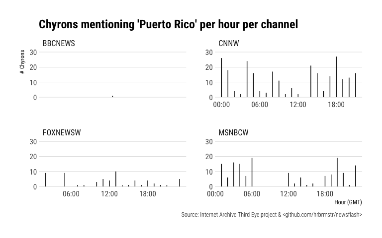
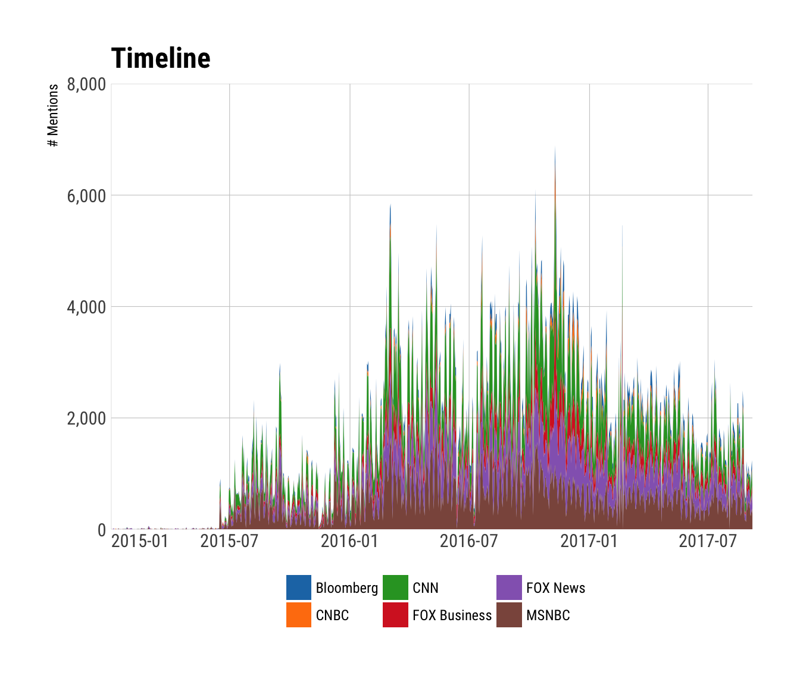
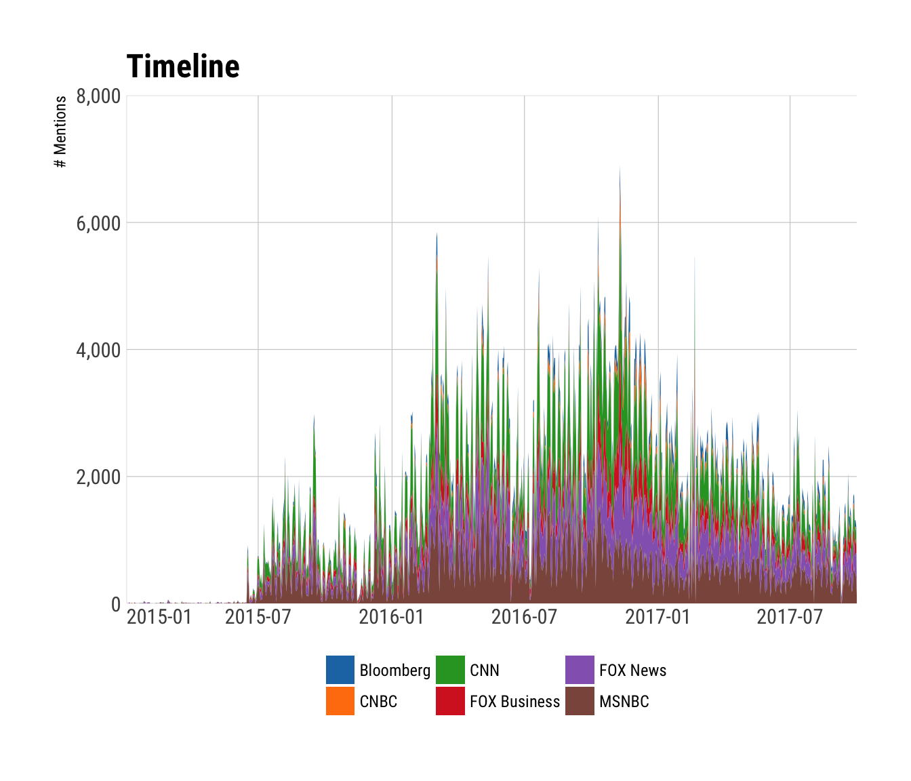

`newsflash` : Tools to Work with the Internet Archive and GDELT Television Explorer

Ref:

-   <http://television.gdeltproject.org/cgi-bin/iatv_ftxtsearch/iatv_ftxtsearch>
-   <https://archive.org/details/third-eye>

TV Explorer: &gt;*"In collaboration with the Internet Archive's Television News Archive, GDELT's Television Explorer allows you to keyword search the closed captioning streams of the Archive's 6 years of American television news and explore macro-level trends in how America's television news is shaping the conversation around key societal issues. Unlike the Archive's primary Television News interface, which returns results at the level of an hour or half-hour "show," the interface here reaches inside of those six years of programming and breaks the more than one million shows into individual sentences and counts how many of those sentences contain your keyword of interest. Instead of reporting that CNN had 24 hour-long shows yesterday that mentioned Donald Trump, the interface here will count how many sentences uttered on CNN yesterday mentioned his name - a vastly more accurate metric for assessing media attention."*

Third Eye: &gt;*The TV News Archive's Third Eye project captures the chyrons–or narrative text–that appear on the lower third of TV news screens and turns them into downloadable data and a Twitter feed for research, journalism, online tools, and other projects. At project launch (September 2017) we are collecting chyrons from BBC News, CNN, Fox News, and MSNBC–more than four million collected over just two weeks."*

An advantage of using this over the TV Explorer interactive selector & downloader or Third Eye API is that you get tidy tibbles with this package, ready to use in R.

NOTE: While I don't claim that this alpha-package is anywhere near perfect, the IA/GDELT TV API hiccups every so often so when there are critical errors run the same query in their web interface before submitting an issue. I kept getting errors when searching all affiliate markets for the "mexican president" query that also generate errors on the web site when JSON is selected as output (it's fine on the web site if the choice is interactive browser visualizations). Submit those errors to them, not here.

NOTE: As of 2017-01-29 the API is not returning `keyword_primary` in the `query_details` field. It's not an error with this package.

The following functions are implemented:

-   `query_tv`: Issue a query to the TV Explorer
-   `top_text`: Helper function to extract the text snippets from the top matches as a tidytext-compatible tibble or plain character vector
-   `list_networks`: Helper function to identify station/network keyword and corpus date range for said market
-   `top_trending`: Top Trending Tables
-   `top_trending_ranged`: Top Trending Tables (**you should use this one**)
-   `print.newsflash`: Helper print method for a nicer default text summary
-   `read_chyrons`: Retrieve TV News Archive chyrons from the Internet Archive's Third Eye project
-   `list_chyrons`: Retrieve Third Eye chyron index
-   `view_clip`: View news segment clips from chyron details frament

### Installation

``` r
devtools::install_github("hrbrmstr/newsflash")
```

``` r
options(width=120)
```

### Usage

``` r
library(newsflash)
library(ggalt)
library(hrbrthemes)
library(tidyverse)

# current verison
packageVersion("newsflash")
```

    ## [1] '0.6.0'

"Third Eye" Chyrons are simpler so we'll start with them first:

``` r
list_chyrons()
```

    ## # A tibble: 61 x 3
    ##            ts    type     size
    ##        <date>   <chr>    <dbl>
    ##  1 2017-09-30 cleaned   539061
    ##  2 2017-09-30     raw 17927121
    ##  3 2017-09-29 cleaned   635812
    ##  4 2017-09-29     raw 19234407
    ##  5 2017-09-28 cleaned   414067
    ##  6 2017-09-28     raw 12663606
    ##  7 2017-09-27 cleaned   613474
    ##  8 2017-09-27     raw 20442644
    ##  9 2017-09-26 cleaned   659930
    ## 10 2017-09-26     raw 19942951
    ## # ... with 51 more rows

``` r
ch <- read_chyrons("2017-09-30")

mutate(
  ch, 
  hour = lubridate::hour(ts),
  text = tolower(text),
  mention = grepl("erto ri", text)
) %>% 
  filter(mention) %>% 
  count(hour, channel) %>% 
  ggplot(aes(hour, n)) +
  geom_segment(aes(xend=hour, yend=0)) +
  scale_x_continuous(name="Hour (GMT)", breaks=seq(0, 23, 6),
                     labels=sprintf("%02d:00", seq(0, 23, 6))) +
  scale_y_continuous(name="# Chyrons", limits=c(0,30)) +
  facet_wrap(~channel, scales="free") +
  labs(title="Chyrons mentioning 'Puerto Rico' per hour per channel",
       caption="Source: Internet Archive Third Eye project & <github.com/hrbrmstr/newsflash>") +
  theme_ipsum_rc(grid="Y")
```



Now for the TV Explorer:

See what networks & associated corpus date ranges are available:

``` r
list_networks(widget=FALSE)
```

    ## # A tibble: 56 x 3
    ##                       keyword                             network                          date_range
    ##                         <chr>                               <chr>                               <chr>
    ##  1                   NATIONAL               All National Networks (See individual networks for dates)
    ##  2                  BLOOMBERG                           Bloomberg             (12/5/2013 - 10/1/2017)
    ##  3                       CNBC                                CNBC              (7/2/2009 - 9/30/2017)
    ##  4                        CNN                                 CNN              (7/2/2009 - 10/1/2017)
    ##  5                        FBC                        FOX Business             (8/20/2012 - 10/1/2017)
    ##  6                   FOXNEWSW                            FOX News             (7/16/2011 - 10/1/2017)
    ##  7                      MSNBC                               MSNBC              (7/2/2009 - 10/1/2017)
    ##  8              INTERNATIONAL          All International Networks (See individual networks for dates)
    ##  9                 BBCNEWSSEG                            BBC News              (1/1/2017 - 10/1/2017)
    ## 10       NATIONALDISCONTINUED  All Discontinued National Networks (See individual networks for dates)
    ## 11                    ALJAZAM                   Aljazeera America             (8/20/2013 - 4/13/2016)
    ## 12                        ALL           All Combined All Networks (See individual networks for dates)
    ## 13                        ALL                                <NA>                                <NA>
    ## 14                  AFFNETALL              All Affiliate Networks (See individual networks for dates)
    ## 15                 AFFNET_ABC              ABC Affiliate Stations              (7/2/2009 - 10/1/2017)
    ## 16                 AFFNET_CBS              CBS Affiliate Stations              (7/2/2009 - 10/1/2017)
    ## 17                 AFFNET_FOX              FOX Affiliate Stations              (7/3/2009 - 10/1/2017)
    ## 18                AFFNET_MYTV             MYTV Affiliate Stations            (12/11/2015 - 12/2/2016)
    ## 19                 AFFNET_NBC              NBC Affiliate Stations              (7/2/2009 - 10/1/2017)
    ## 20                 AFFNET_PBS              PBS Affiliate Stations             (7/14/2010 - 10/1/2017)
    ## 21                 AFFMARKALL               All Affiliate Markets (See individual networks for dates)
    ## 22           AFFMARKET_Boston           Boston Affiliate Stations             (9/30/2015 - 12/2/2016)
    ## 23     AFFMARKET_Cedar Rapids     Cedar Rapids Affiliate Stations            (10/19/2015 - 12/2/2016)
    ## 24        AFFMARKET_Charlotte        Charlotte Affiliate Stations              (2/9/2016 - 3/23/2016)
    ## 25       AFFMARKET_Cincinnati       Cincinnati Affiliate Stations              (1/6/2016 - 3/23/2016)
    ## 26        AFFMARKET_Cleveland        Cleveland Affiliate Stations              (1/6/2016 - 12/2/2016)
    ## 27 AFFMARKET_Colorado Springs Colorado Springs Affiliate Stations              (1/19/2016 - 3/9/2016)
    ## 28         AFFMARKET_Columbia         Columbia Affiliate Stations             (12/28/2015 - 3/2/2016)
    ## 29  AFFMARKET_Dakota Dunes SD  Dakota Dunes SD Affiliate Stations             (10/13/2015 - 3/2/2016)
    ## 30    AFFMARKET_Daytona Beach    Daytona Beach Affiliate Stations              (1/6/2016 - 3/23/2016)
    ## 31           AFFMARKET_Denver           Denver Affiliate Stations              (1/1/2016 - 12/2/2016)
    ## 32       AFFMARKET_Des Moines       Des Moines Affiliate Stations             (10/14/2015 - 3/2/2016)
    ## 33           AFFMARKET_Durham           Durham Affiliate Stations             (1/13/2016 - 3/23/2016)
    ## 34        AFFMARKET_Goldsboro        Goldsboro Affiliate Stations             (1/13/2016 - 12/2/2016)
    ## 35       AFFMARKET_Greenville       Greenville Affiliate Stations             (12/28/2015 - 3/2/2016)
    ## 36          AFFMARKET_Hampton          Hampton Affiliate Stations               (1/6/2016 - 3/9/2016)
    ## 37        AFFMARKET_Las Vegas        Las Vegas Affiliate Stations            (12/11/2015 - 12/2/2016)
    ## 38        AFFMARKET_Lynchburg        Lynchburg Affiliate Stations              (1/26/2016 - 3/1/2016)
    ## 39            AFFMARKET_Miami            Miami Affiliate Stations              (1/6/2016 - 3/23/2016)
    ## 40       AFFMARKET_Newport KY       Newport KY Affiliate Stations              (1/6/2016 - 3/23/2016)
    ## 41          AFFMARKET_Norfolk          Norfolk Affiliate Stations               (1/6/2016 - 3/9/2016)
    ## 42          AFFMARKET_Orlando          Orlando Affiliate Stations              (1/6/2016 - 3/23/2016)
    ## 43     AFFMARKET_Philadelphia     Philadelphia Affiliate Stations              (6/6/2014 - 10/1/2017)
    ## 44       AFFMARKET_Portsmouth       Portsmouth Affiliate Stations               (1/6/2016 - 3/9/2016)
    ## 45           AFFMARKET_Pueblo           Pueblo Affiliate Stations              (1/19/2016 - 3/9/2016)
    ## 46          AFFMARKET_Raleigh          Raleigh Affiliate Stations             (1/13/2016 - 12/2/2016)
    ## 47             AFFMARKET_Reno             Reno Affiliate Stations               (1/1/2016 - 3/2/2016)
    ## 48          AFFMARKET_Roanoke          Roanoke Affiliate Stations              (1/26/2016 - 3/1/2016)
    ## 49    AFFMARKET_San Francisco    San Francisco Affiliate Stations             (7/14/2010 - 10/1/2017)
    ## 50   AFFMARKET_Shaker Heights   Shaker Heights Affiliate Stations              (1/6/2016 - 12/2/2016)
    ## 51       AFFMARKET_Sioux City       Sioux City Affiliate Stations             (10/13/2015 - 3/2/2016)
    ## 52   AFFMARKET_St. Petersburg   St. Petersburg Affiliate Stations              (1/6/2016 - 12/2/2016)
    ## 53            AFFMARKET_Tampa            Tampa Affiliate Stations              (1/6/2016 - 12/2/2016)
    ## 54   AFFMARKET_Virginia Beach   Virginia Beach Affiliate Stations               (1/7/2016 - 3/8/2016)
    ## 55    AFFMARKET_Washington DC    Washington DC Affiliate Stations              (7/2/2009 - 9/22/2017)
    ## 56         AFFMARKET_Waterloo         Waterloo Affiliate Stations            (10/19/2015 - 12/2/2016)

Basic search:

``` r
query_tv("clinton", "email", "AFFMARKALL")
```

    ## Query:
    ##    Primary keyword: clinton 
    ##   Context keywords: email 
    ##           Stations: AFFMARKALL 
    ##         Start date: 2009-07-02 
    ##           End date: 2017-10-01 
    ## 
    ## 247,066 timeline results from 82 stations:
    ## 
    ##   +--+--------------------+------------------*-+--------------------+-------------------+------+
    ## 8 +                                          *                                             *   +
    ## 6 +                                          *                                             *   +
    ##   |              *                  *        *                 *                           *   |
    ## 4 +   * *        *          *       *        *                 * *                         *   +
    ## 2 +   * *        *   *     **       *    *   *  *        *     * * **   *  *         * **  *   +
    ##   |   *** **   * *   ** *****    *****   *   *******     ***   * * ***  ** ***  *    **** **   |
    ## 0 +--+*******-************************-*************************-************************-**---+
    ##      0                   20                   40                   60                  80       
    ## Legend: 
    ## 1=ABC - Boston (WCVB), 2=ABC - Boston (WMUR), 3=ABC - Cedar Rapids (KCRG), 4=ABC - Charlotte (WS
    ## OC), 5=ABC - Cincinnati (WCPO), 6=ABC - Cleveland (WEWS), 7=ABC - Colorado Springs (KRDO), 8=ABC
    ##  - Columbia (WOLO), 9=ABC - Denver (KMGH), 10=ABC - Hampton (WVEC), 11=ABC - Las Vegas (KTNV), 1
    ## 2=ABC - Lynchburg (WSET), 13=ABC - Miami (WPLG), 14=ABC - Orlando (WFTV), 15=ABC - Philadelphia 
    ## (WPVI), 16=ABC - Reno (KOLO), 17=ABC - San Francisco (KGO), 18=ABC - Sioux City (KCAU), 19=ABC -
    ##  Tampa (WFTS), 20=ABC - Washington DC (WJLA), 21=CBS - Boston (WBZ), 22=CBS - Cedar Rapids (KGAN
    ## ), 23=CBS - Charlotte (WBTV), 24=CBS - Cincinnati (WKRC), 25=CBS - Colorado Springs (KKTV), 26=C
    ## BS - Columbia (WLTX), 27=CBS - Dakota Dunes SD (KMEG), 28=CBS - Denver (KCNC), 29=CBS - Des Moin
    ## es (KCCI), 30=CBS - Las Vegas (KLAS), 31=CBS - Miami (WFOR), 32=CBS - Norfolk (WTKR), 33=CBS - O
    ## rlando (WKMG), 34=CBS - Philadelphia (KYW), 35=CBS - Raleigh (WRAL), 36=CBS - Reno (KTVN), 37=CB
    ## S - Roanoke (WDBJ), 38=CBS - San Francisco (KPIX), 39=CBS - Shaker Heights (WOIO), 40=CBS - St. 
    ## Petersburg (WTSP), 41=CBS - Washington DC (WUSA), 42=FOX - Boston (WFXT), 43=FOX - Cedar Rapids 
    ## (KFXA), 44=FOX - Cleveland (WJW), 45=FOX - Columbia (WACH), 46=FOX - Dakota Dunes SD (KPTH), 47=
    ## FOX - Denver (KDVR), 48=FOX - Des Moines (KDSM), 49=FOX - Greenville (WHNS), 50=FOX - Las Vegas 
    ## (KVVU), 51=FOX - Newport KY (WXIX), 52=FOX - Orlando (WOFL), 53=FOX - Philadelphia (WTXF), 54=FO
    ## X - Raleigh (WRAZ), 55=FOX - Roanoke (WFXR), 56=FOX - San Francisco (KTVU), 57=FOX - Tampa (WTVT
    ## ), 58=FOX - Virginia Beach (WVBT), 59=FOX - Washington DC (WTTG), 60=MYTV - Las Vegas (KSNV), 61
    ## =NBC - Boston (WHDH), 62=NBC - Charlotte (WCNC), 63=NBC - Cincinnati (WLWT), 64=NBC - Cleveland 
    ## (WKYC), 65=NBC - Columbia (WIS), 66=NBC - Daytona Beach (WESH), 67=NBC - Denver (KUSA), 68=NBC -
    ##  Des Moines (WHO), 69=NBC - Goldsboro (WNCN), 70=NBC - Greenville (WYFF), 71=NBC - Miami (WTVJ),
    ##  72=NBC - Philadelphia (WCAU), 73=NBC - Portsmouth (WAVY), 74=NBC - Pueblo (KOAA), 75=NBC - Reno
    ##  (KRNV), 76=NBC - Roanoke (WSLS), 77=NBC - San Francisco (KNTV), 78=NBC - Sioux City (KTIV), 79=
    ## NBC - Tampa (WFLA), 80=NBC - Washington DC (WRC), 81=NBC - Waterloo (KWWL), 82=PBS - San Francis
    ## co (KQED)
    ## 
    ## 2,500 top query matches from the following shows:
    ## 
    ## # A tibble: 480 x 3
    ##                       station                            show     n
    ##                         <chr>                           <chr> <int>
    ##  1 PBS - San Francisco (KQED)                    PBS NewsHour   152
    ##  2        ABC - Boston (WCVB)          Newscenter 5 Eyeopener    74
    ##  3 PBS - San Francisco (KQED) Washington Week With Gwen Ifill    49
    ##  4 CBS - San Francisco (KPIX)              KPIX 5 News at 6AM    44
    ##  5 CBS - San Francisco (KPIX)              KPIX 5 News at 5PM    42
    ##  6 CBS - San Francisco (KPIX)      KPIX 5 News  Early Edition    40
    ##  7 CBS - San Francisco (KPIX)              KPIX 5 News at 5AM    40
    ##  8 CBS - San Francisco (KPIX)            KPIX 5 News at 600PM    34
    ##  9 PBS - San Francisco (KQED)                    Charlie Rose    33
    ## 10  ABC - Philadelphia (WPVI)          Action News at 1230 PM    31
    ## # ... with 470 more rows

The closed-caption text snippets are returned for the "top matches" (usually max 2,500 for a broad enough search) and you can extract them from the object directly with `x$top_matches$snippet` or use `top_text(x)`:

``` r
mex <- query_tv("mexican president", filter_network="NATIONAL")
top_text(mex)
```

    ## # A tibble: 198,518 x 4
    ##    station                    show           show_date         word
    ##      <chr>                   <chr>              <dttm>        <chr>
    ##  1   MSNBC Andrea Mitchell Reports 2017-08-08 16:00:00         well
    ##  2   MSNBC Andrea Mitchell Reports 2017-08-08 16:00:00          the
    ##  3   MSNBC Andrea Mitchell Reports 2017-08-08 16:00:00   transcript
    ##  4   MSNBC Andrea Mitchell Reports 2017-08-08 16:00:00           of
    ##  5   MSNBC Andrea Mitchell Reports 2017-08-08 16:00:00          the
    ##  6   MSNBC Andrea Mitchell Reports 2017-08-08 16:00:00 conversation
    ##  7   MSNBC Andrea Mitchell Reports 2017-08-08 16:00:00         with
    ##  8   MSNBC Andrea Mitchell Reports 2017-08-08 16:00:00     mexico's
    ##  9   MSNBC Andrea Mitchell Reports 2017-08-08 16:00:00    president
    ## 10   MSNBC Andrea Mitchell Reports 2017-08-08 16:00:00        tells
    ## # ... with 198,508 more rows

``` r
head(top_text(mex, tidy=FALSE))
```

    ## [1] "well, the transcript of the conversation with mexico's president tells us so much about the promise and the delivery on that promise. yeah. the best thing that could have happened to president pena nieto. mexicans saw that as the president standing up for the country. mexican president -- mexican president."                                                                          
    ## [2] "i had to watch it a couple of times. he was nervous. cat got his tongue whatever. trudeau, his neighbor in canada. the mexican president."                                                                                                                                                                                                                                                     
    ## [3] "selectselected care about the middle east be at the economic ones are understated because we will not have to shift so much capital abroad, everyone wants to buy foreign oil. ashley: the other issue is security. some have been undone or completely scrapped for the current mexican president. something that will not get resolved on this summit. the mexican president will push back."
    ## [4] "walk in, hey let's get to know each other. that is all he was ever going to do. except he was not consistent. it was never discussed. mexican president."                                                                                                                                                                                                                                      
    ## [5] "i'm sorry to cut you off. thank you very much. i appreciate you joining us. pint made. former mexican president fox."                                                                                                                                                                                                                                                                          
    ## [6] "we may have to rename it. it's going to be different. in mexico you can't succeed yourself. get to know him. the new mexican president."

You can, of course, do other things with the various bits of data returned:

``` r
orange <- query_tv("trump")
```

``` r
arrange(orange$station_histogram, value) %>% 
  mutate(station=factor(station, levels=station)) %>% 
  ggplot(aes(value, station)) +
  geom_lollipop(horizontal=TRUE, size=0.75,
                color=ggthemes::tableau_color_pal()(10)[2]) +
  scale_x_continuous(expand=c(0,0), label=scales::comma, limits=c(0,400000)) +
  labs(y=NULL, x="# Mentions",
       title="Station Histogram") +
  theme_ipsum_rc(grid="X")
```

    ## Warning: Removed 2 rows containing missing values (geom_lollipop).



``` r
mutate(orange$timeline, date_start=as.Date(date_start)) %>% 
  filter(date_start >= as.Date("2015-01-01")) %>% 
  ggplot(aes(date_start, value)) +
  geom_area(aes(group=station, fill=station), position="stack") +
  scale_x_date(name=NULL, expand=c(0,0)) +
  scale_y_continuous(name="# Mentions", label=scales::comma, limits=c(0, 8000), expand=c(0,0)) +
  ggthemes::scale_fill_tableau(name=NULL) +
  labs(title="Timeline") +
  theme_ipsum_rc(grid="XY") +
  theme(legend.position="bottom") +
  theme(axis.text.x=element_text(hjust=c(0, 0.5, 0.5, 0.5, 0.5, 0.5)))
```



The following is dynamically generated from the query results. View the R Markdown to see the code.

#### CNBC / Squawk Box

<https://archive.org/details/CNBC_20090814_100000_Squawk_Box#start/10780/end/10815>

<!--html_preserve-->
<!--/html_preserve-->

> "that was part of this. that was a great name, you know. phenomenal. 🍊 people. 🍊 cars."

``` r
from <- as.POSIXct("2017-09-08 18:00:00")
to <- as.POSIXct("2017-09-09 06:00:00")

tops <- top_trending_range(from, to)

rev(tail(sort(table(unlist(tops$overall_trending_phrases))), 20))
```

    ## 
    ##                storm surge             miles per hour        asked the president               month period 
    ##                         48                         47                         47                         43 
    ##              southern part               worst storms            west palm beach           today is the day 
    ##                         40                         39                         39                         39 
    ##      thing for your family                storms path          side of the storm        running out of time 
    ##                         39                         39                         39                         39 
    ##         ride out the storm        ordered to evacuate   national weather service              love in texas 
    ##                         39                         39                         39                         39 
    ##    entire state of florida coverage of hurricane irma             coast to coast            evacuation zone 
    ##                         39                         39                         39                         37

Test Results
------------

``` r
library(newsflash)
library(testthat)

date()
```

    ## [1] "Sun Oct  1 08:53:28 2017"

``` r
test_dir("tests/")
```

    ## testthat results ========================================================================================================
    ## OK: 0 SKIPPED: 0 FAILED: 0
    ## 
    ## DONE ===================================================================================================================
